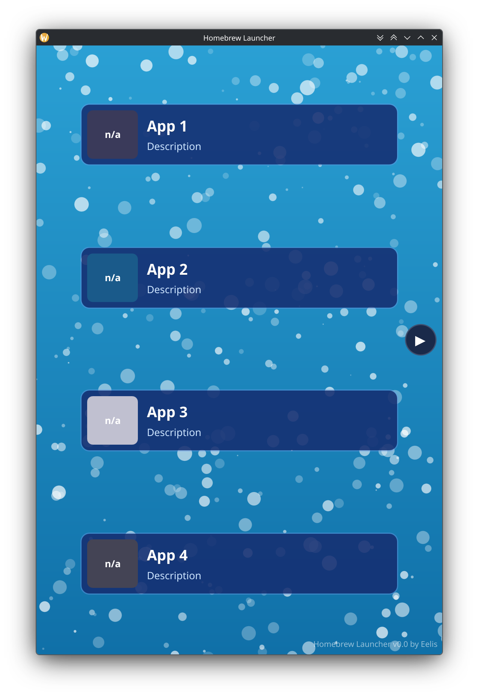

# Homebrew Launcher LX
Simple and lightweight .sh and App loader for devices running any linux distro. Current primary target: postmarketOS. Based on the WiiU homebrew launcher GUI 
There will be a set path, where users put in folders containg .sh files that can then be executed from the homebrew launcher. Useful for mobile devices running linux and desktop too. Apps can also be launched from it, but the primary usecase should be .sh files. For apps and programs I'm making Loadiine-pmOS as an alternative application launcher on mobile linux. 

(LX = Linux. Wanted to add something to avoid confusion with the WiiU Homebrew Launcher)

Currently its only GUI and doesnt have any functioning features! 

## Screenshots

## Usage
Any loadable .sh file will appear in the homebrew launcher LX if copied to the right path. Will be using a folder named "hbl" in the user directory, the subfolder will be named "apps", in the apps folder either just the .sh files or folders containing an xml file with basic information about the .sh file and an icon. 

Example: 

- Eelis:/
  - hbl/
    - apps/
     - shutdown/
        - shutdown.sh
        - meta.xml
        - icon.png

## Credits
Design Idea came from the WiiU Homebrew Launcher by dimok
https://github.com/dimok789/homebrew_launcher
